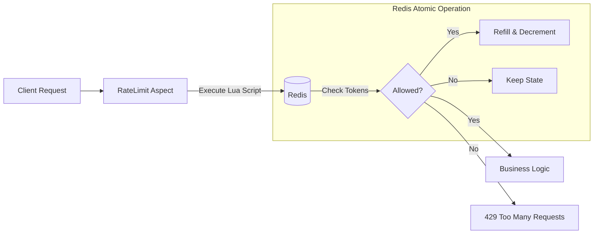

# 🛡️ Spring Redis Rate Limiter

[](https://www.oracle.com/java/)
[](https://spring.io/projects/spring-boot)
[](https://redis.io/)
[](LICENSE)

> **대규모 트래픽 공격(L7 DDoS)으로부터 서비스 가용성(Availability)을 확보하기 위한 애플리케이션 레벨의 트래픽 제어 시스템입니다.**

## 📖 Project Overview

최근 DDoS 공격은 단순한 네트워크 대역폭 소진(L3/L4)을 넘어, 애플리케이션의 비즈니스 로직을 악용하여 자원을 고갈시키는 ``L7(HTTP Flood, Slowloris) 공격``으로 진화하고 있습니다. 기존의 네트워크 방화벽이나 WAF만으로는 정상적인 요청으로 위장한 과도한 트래픽(예: 초당 100회 API 호출)을 정교하게 제어하기 어렵습니다.

이 프로젝트는 Spring Boot AOP와 Redis를 활용하여, 분산 환경에서도 Race Condition 없이 고성능으로 동작하는 Rate Limiter를 구현하고 검증하는 것을 목표로 합니다.

## ✨ Key Features

* **Traffic Throttling**: **Token Bucket 알고리즘**을 적용하여 순간적인 트래픽 버스트(Burst)를 유연하게 처리하면서도 평균 유입량을 제어합니다.
* **Atomic Operations**: **Lua Script**를 사용하여 Redis 내부에서 `조회(Get)`와 `갱신(Set)`을 원자적(Atomic)으로 수행, 동시성 이슈를 원천 차단했습니다.
* **Easy to Use**: Custom Annotation(`@RateLimit`) 기반의 AOP로 구현되어, 비즈니스 로직 변경 없이 원하는 API에 즉시 적용 가능합니다.
* **High Performance**: Disk I/O가 없는 In-Memory 저장소(Redis)를 사용하여 지연 시간(Latency)을 최소화했습니다.

## 🛠 Tech Stack

* **Language**: Java 17
* **Framework**: Spring Boot 3.x (Spring AOP)
* **Storage**: Redis (Stand-alone / Docker)
* **Scripting**: Lua
* **Testing**: JUnit 5, k6 (Load Testing)

## 🏗 Architecture

요청이 Controller에 도달하기 전, AOP가 가로채어 Redis 내의 Lua Script를 실행합니다.



## 🚀 Getting Started

### Prerequisites

* JDK 17+
* Docker (for Redis)

### Installation & Run

1. **Clone the repository**
```bash
git clone https://github.com/HSHwan/spring-redis-ratelimiter.git
cd spring-redis-ratelimiter

```


2. **Run Redis (Docker)**
```bash
docker run --name rate-limit-redis -p 6379:6379 -d redis

```


3. **Run Application**
```bash
./gradlew bootRun

```


## 💻 Usage Example

`@RateLimit` 어노테이션을 사용하여 API별로 허용량(limit)과 기간(period)을 설정할 수 있습니다.

```java
@RestController
@RequiredArgsConstructor
public class ProductController {

    // 1초에 최대 10번 요청 허용
    @RateLimit(limit = 10, period = 1)
    @GetMapping("/api/products")
    public ResponseEntity<List<Product>> getProducts() {
        return ResponseEntity.ok(productService.findAll());
    }
}

```

## 🧪 Performance & Verification

본 프로젝트는 **k6**를 활용하여 대규모 부하 테스트를 수행합니다.

* **Concurrency Test**: 멀티 스레드 환경에서 카운트가 정확히 차감되는지 검증
* **Latency Test**: Rate Limiter 적용 전후의 응답 속도 비교
* **Throughput Test**: 임계치 초과 시 정확하게 `429 Too Many Requests`를 반환하는지 확인

(추후 테스트 결과 작성 예정)

## 📅 Roadmap

* [x] 자료 조사 및 Token Bucket 알고리즘 선정
* [x] Redis & Lua Script 기반 핵심 로직 구현
* [x] Spring AOP 연동 및 예외 처리 구현
* [ ] k6 부하 테스트 및 임계치 튜닝
* [ ] **Spring Boot Starter 라이브러리화 (v1.0.0 Release)**

## 📄 License

This project is licensed under the MIT License.