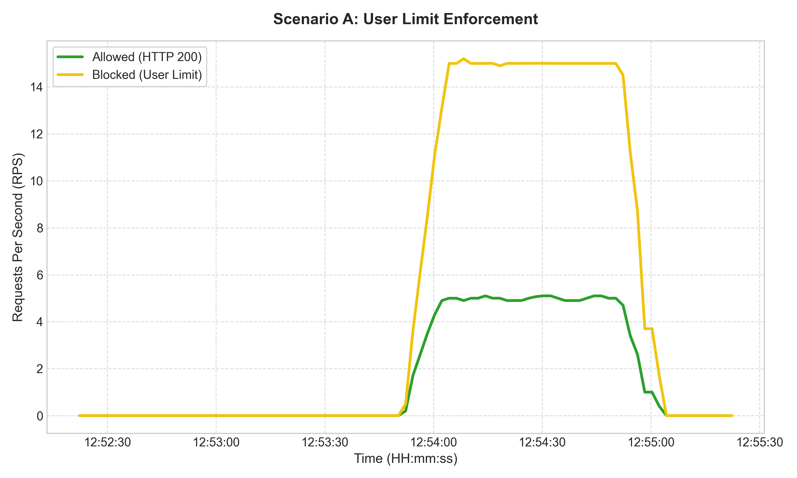
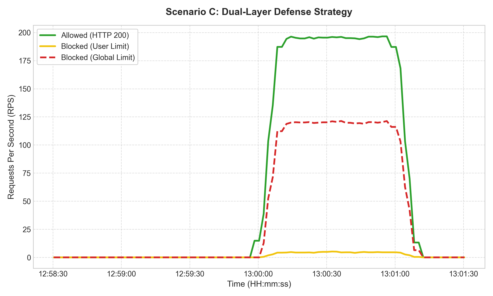
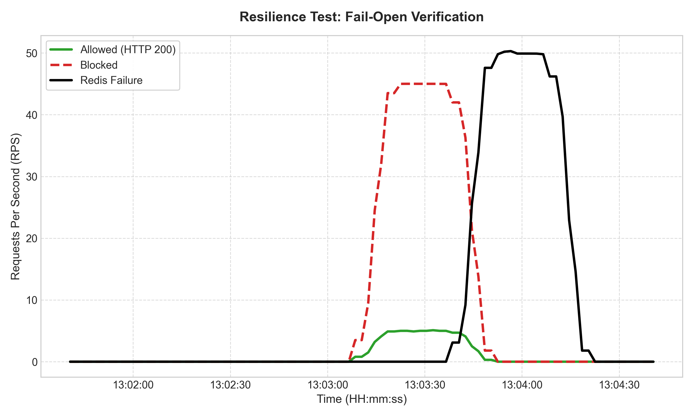

# 🛡️ Spring Redis Rate Limiter: Distributed L7 DDoS Defense System

[](https://www.oracle.com/java/)
[](https://spring.io/projects/spring-boot)
[](https://redis.io/)
[](https://www.lua.org/)
[](LICENSE)

> **정교한 L7 DDoS 공격(HTTP Flooding)에 대응하기 위한 분산 Rate Limiter입니다.**
> **Redis Lua Script를 활용한 원자적 연산과 Fail-Open 정책을 통해 강력한 보안성과 고가용성(High Availability)을 동시에 보장합니다.**

## 📖 Project Overview

현대의 DDoS 공격은 단순한 네트워크 대역폭 소진(L3/L4)을 넘어, 웹 애플리케이션의 비즈니스 로직을 악용하는 **L7 공격**으로 진화하고 있습니다. 본 프로젝트는 이러한 위협에 대응하기 위해 **Spring Boot AOP**와 **Redis**를 활용하여 다음과 같은 목표를 달성했습니다.

* **분산 환경 지원**: 다수의 서버 인스턴스 간 상태 동기화
* **데이터 정합성 보장**: Race Condition 없는 정확한 카운팅
* **비즈니스 연속성**: 보안 인프라 장애 시 서비스 중단 방지 (Fail-Open)

## ✨ Key Features

### 1. 🛡️ Dual-Layer Defense Strategy (이중 방어)
단일 방어선의 한계를 극복하기 위해 두 단계의 계층적 방어 전략을 적용했습니다.
* **Layer 1 (Global Limit)**: 서비스 전체 용량을 초과하는 대규모 트래픽(Botnet 등)을 제어하여 시스템 셧다운 방지 (Traffic Shaping)
* **Layer 2 (User Limit)**: 특정 사용자(IP/User ID)의 비정상적인 요청 빈도를 감지하고 격리 (Isolation)

### 2. ⚡ Atomic Operations with Lua Script
**Token Bucket 알고리즘**을 Redis **Lua Script**로 구현하여, `조회(Get)`와 `갱신(Set)` 과정을 하나의 원자적(Atomic) 연산으로 처리했습니다. 이를 통해 분산 환경의 고질적인 문제인 **Race Condition**을 별도의 락(Lock) 없이 해결했습니다.

### 3. 🔄 Resilience & Fail-Open
보안 시스템의 장애가 서비스 전체의 장애(SPOF)로 전파되지 않도록 설계했습니다. Redis 연결 타임아웃(100ms) 발생 시 **Fail-Open 정책**이 발동하여, 트래픽을 차단하지 않고 통과시켜 서비스 가용성(Availability)을 최우선으로 보장합니다.

## 🛠 Tech Stack

* **Core**: Java 17, Spring Boot 3.x
* **Storage**: Redis (Stand-alone / Docker)
* **Logic**: Lua Script, Spring AOP
* **Testing**: k6 (Load Testing), JUnit 5
* **Monitoring**: Prometheus, Grafana

## 🏗 Architecture

```mermaid
graph LR
    Client[Client Request] --> AOP[RateLimit Aspect]
    AOP -->|Execute Lua Script| Redis[(Redis)]
    
    subgraph "Dual-Layer Validation (Lua)"
        Redis -->|Check User Limit| L2{Layer 2 Passed?}
        L2 -->|Yes| L1{Layer 1 Passed?}
        L1 -->|Yes| Refill[Refill & Decrement]
        L2 -->|No| BlockUser[Block (User Limit)]
        L1 -->|No| BlockGlobal[Block (Global Limit)]
    end
    
    Refill --> Controller[Business Logic]
    BlockUser --> Exception[429 Too Many Requests]
    BlockGlobal --> Exception[429 Too Many Requests]
    
    Redis -.->|Timeout/Down| FailOpen[Fail-Open Log]
    FailOpen --> Controller

```

## 🚀 Getting Started

이 프로젝트는 로컬 개발 환경에서 즉시 실행해 볼 수 있도록 구성되어 있습니다.
애플리케이션 실행 전, **Redis**와 모니터링 도구(**Prometheus, Grafana**)가 Docker 환경에서 구동되어야 합니다.

### 📋 Prerequisites

프로젝트 실행을 위해 다음 도구들이 설치되어 있어야 합니다.

* **Java 17** 이상: [Oracle JDK](https://www.oracle.com/java/technologies/downloads/) 또는 [OpenJDK](https://openjdk.org/)
* **Docker & Docker Compose**: 컨테이너 기반 인프라 구동을 위해 필수입니다. [Docker Desktop](https://www.docker.com/products/docker-desktop/) 설치를 권장합니다.
* **Git**: 소스 코드 클론용

### ⚙️ Installation & Setup

**1. Repository Clone** \
먼저 로컬 환경에 소스 코드를 내려받습니다.
```bash
git clone https://github.com/HSHwan/spring-redis-ratelimiter.git
cd spring-redis-ratelimiter

```

**2. Infrastructure Setup (Docker)** \
Redis(저장소)와 Prometheus/Grafana(모니터링)를 실행합니다. 프로젝트 루트에 포함된 `docker-compose.yml`을 사용하면 한 번에 설정할 수 있습니다.

```bash
# 백그라운드 모드(-d)로 모든 컨테이너 실행
docker-compose up -d

# 실행 상태 확인 (redis, prometheus, grafana 컨테이너가 Up 상태여야 함)
docker-compose ps

```

> **Note**: 기본 포트 설정은 다음과 같습니다.
> * Redis: `6379`
> * Prometheus: `9090`
> * Grafana: `3000` (ID/PW: admin/admin)

**3. Application Configuration (Optional)** \
기본적으로 `localhost:6379`의 Redis에 연결하도록 설정되어 있습니다. 설정을 변경하려면 `src/main/resources/application.yml` 파일을 수정하세요.

```yaml
spring:
  data:
    redis:
      host: localhost # Docker 환경에 맞게 수정
      port: 6379

```

**4. Run Application**
Gradle Wrapper를 사용하여 애플리케이션을 빌드하고 실행합니다.

```bash
# Linux/macOS
./gradlew bootRun

# Windows
.\gradlew.bat bootRun

```

---

### ✅ Verification (테스트 해보기)

애플리케이션이 정상적으로 실행되었다면(`Started Application in ... seconds`), 다음 명령어로 Rate Limiter 동작을 확인할 수 있습니다.

**1. API 호출 테스트 (Dual-Layer 적용 엔드포인트)** \
터미널에서 `curl`을 보내거나 브라우저에서 접속해 봅니다.

```bash
# 정상 요청 (HTTP 200 OK)
curl -v http://localhost:8080/api/test/user-limit

# 반복 호출하여 차단 확인 (임계치 초과 시 HTTP 429 Too Many Requests 반환)
for i in {1..10}; do curl -o /dev/null -s -w "%{http_code}\n" http://localhost:8080/api/test/user-limit; done

```

**2. 모니터링 대시보드 확인** \
부하 테스트 중 실시간 트래픽을 확인하려면 Grafana에 접속하세요.

1. 브라우저에서 `http://localhost:3000` 접속
2. 로그인 (기본값: `admin` / `admin`)
3. **Dashboards** > **Spring Rate Limiter Dashboard (Dual-Layer V3)** 클릭
4. **Allowed** vs **Blocked** 그래프가 실시간으로 그려지는지 확인

## 💻 Usage Example

`@RateLimit` 어노테이션을 사용하여 API별로 **User Limit**과 **Global Limit**을 독립적으로 설정할 수 있습니다.

```java
@RestController
@RequiredArgsConstructor
public class ProductController {

  // Case 1: 이중 방어 적용 (Dual-Layer)
  // - User Limit: 초당 5회 (개별 사용자 제어)
  // - Global Limit: 초당 100회 (전체 트래픽 제어)
  @RateLimit(limit = 5, period = 1, globalLimit = 100, globalPeriod = 1)
  @GetMapping("/api/products")
  public ResponseEntity<List<Product>> getProducts() {
    return ResponseEntity.ok(productService.findAll());
  }

  // Case 2: 사용자 제한만 적용 (Default Global Limit = 0: 비활성)
  // - User Limit: 초당 10회
  @RateLimit(limit = 10, period = 1)
  @GetMapping("/api/my-info")
  public ResponseEntity<MemberInfo> getMyInfo() {
    // ...
  }
}

```

## 🧪 Experimental Results

본 프로젝트는 **k6**를 활용하여 고부하 환경에서의 성능과 안정성을 검증했습니다. (Environment: Docker, Spring Boot 3 Replicas)

### Scenario A: User Limit Enforcement

특정 '헤비 유저'가 임계치(5 RPS)를 초과하여 요청할 때의 차단 성능입니다.


> **분석**: 전체 트래픽 양과 무관하게, 규정을 위반한 특정 사용자의 요청만 정확하게 차단(Yellow Line)되어 5 RPS 이하로 제어됨을 확인했습니다.

### Scenario B: Global Service Protection

대규모 봇넷 공격을 가정하여 시스템 전체 용량(100 RPS) 이상의 부하를 인가했습니다.


> **분석**: 공격 트래픽이 급증하는 구간에서도 허용된 트래픽(Green Line)은 100 RPS를 넘지 않도록 셰이핑(Shaping)되어 백엔드 서버를 보호합니다.

### Scenario C: Dual-Layer Defense Strategy

User Limit과 Global Limit이 동시에 작동하는 복합 공격 상황입니다.


> **분석**: 악성 사용자에 대한 개별 차단(Yellow)과 시스템 과부하에 대한 총량 차단(Red)이 유기적으로 작동하여 이중 방어막을 형성합니다.

### Resilience Test: Fail-Open Verification

운영 중 Redis 컨테이너를 강제 종료하여 장애 상황을 시뮬레이션했습니다.


> **분석**: Redis 장애 발생 즉시(Black Line 상승), 차단 로직이 비활성화되면서 트래픽이 통과(Green Line 상승)됩니다. 이는 **CAP 이론**에 입각하여 가용성을 확보한 결과로, 서비스 다운타임이 발생하지 않았습니다.

## 📅 Roadmap & Achievements

* [x] **Token Bucket 알고리즘 구현**: Burst 트래픽 대응
* [x] **Redis Lua Script 최적화**: 원자적 연산 보장
* [x] **Dual-Layer 아키텍처**: User/Global Limit 분리 적용
* [x] **Fail-Open 전략**: 인프라 장애 대응
* [x] **k6 부하 테스트 및 검증**: 시나리오별 성능 입증

## 📄 License

This project is licensed under the MIT License.